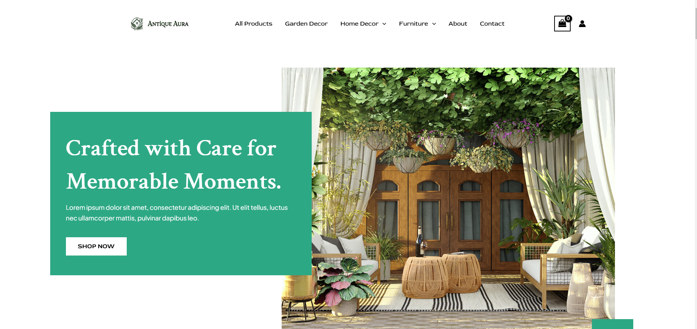
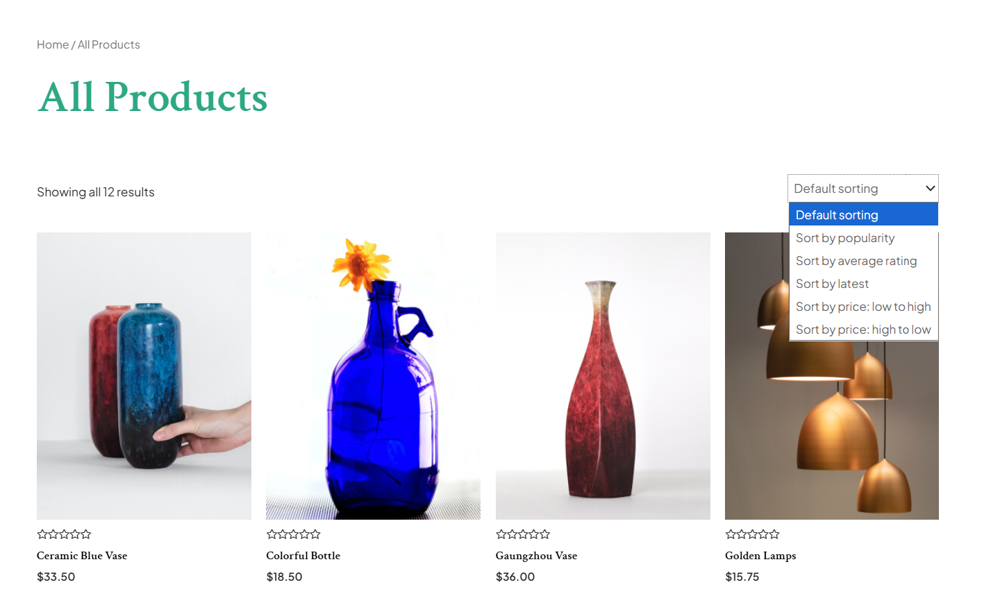
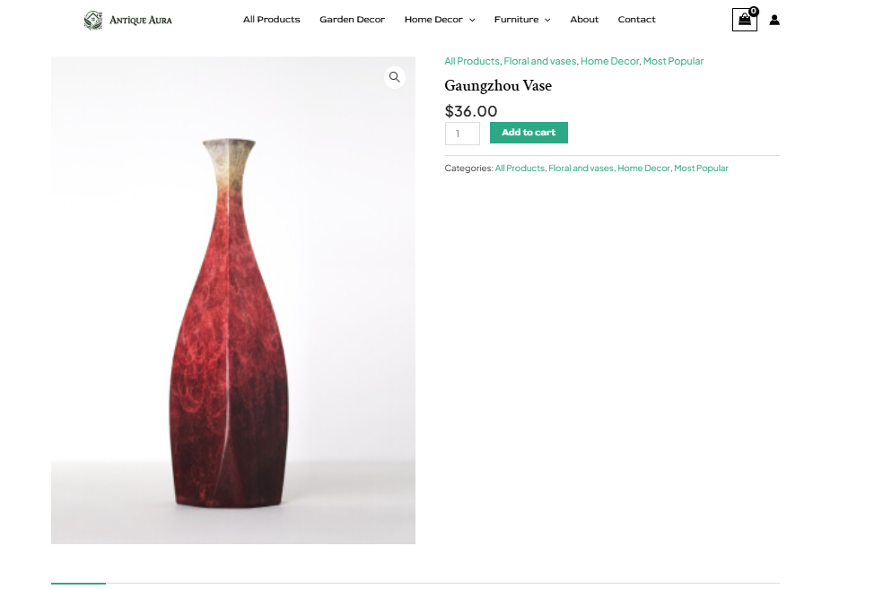
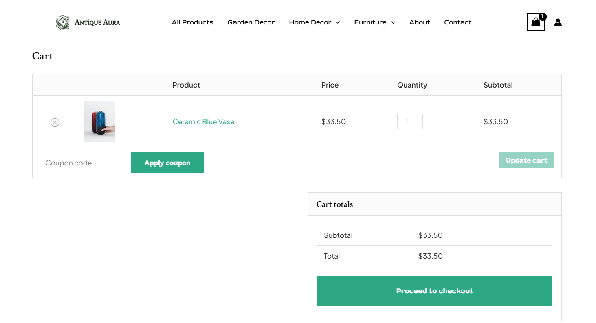
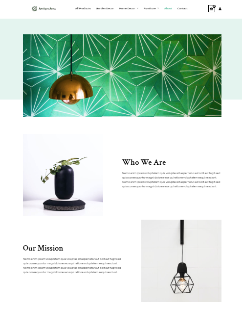
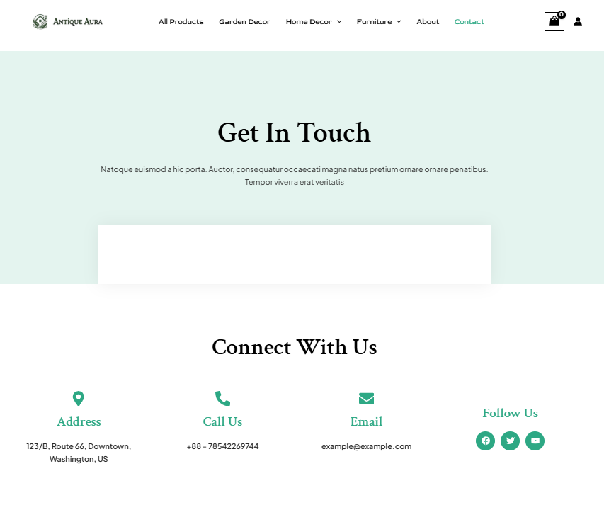

# AntiqueAura - E-commerce Website for Furniture, Home and Garden decor

[](https://antiqueaura.kesug.com/)

**Website URL:** [AntiqueAura](https://antiqueaura.kesug.com/)


## 📖 Project Overview

AntiqueAura is a modern, user-friendly e-commerce platform for stylish home decor, garden essentials, and furniture. Built with **WordPress** and **WooCommerce**, it provides an immersive shopping experience, enabling customers to browse, filter, and purchase products with ease.


## ✨ Key Features
- **Attractive Homepage:** Showcase of featured products and promotions.
- **Organized Product Catalog:** Filter by categories like *Home Decor*, *Garden Decor*, and *Furniture*.
- **Detailed Product Pages:** Clear visuals, pricing, variations (e.g., size, color), and stock availability.
- **User-Friendly Navigation:** Intuitive menus and search filters.
- **Shopping Cart & Checkout:** Easy-to-manage cart and seamless payment options.
- **About & Contact Pages:** Build trust and provide customer support.


## 🖼️ Screenshots

### **Homepage**



### **Products Page**



### **Product Details**



### **Cart Page**



### **About Page**



### **Contact Page**



## 🚀 Getting Started

### Prerequisites
- A web server (e.g., Apache via XAMPP, MAMP, or similar).
- PHP 7.4+ and MySQL 5.7+.
- WordPress (latest stable version).

### Installation Steps
1. Clone this repository:
   ```bash
   git clone https://github.com/yourusername/antiqueaura.git
   ```
2. Extract the `/site_files.zip` into your web server's root directory.
3. Import the database:
   - Open your database tool (e.g., phpMyAdmin).
   - Create a database (e.g., `antiqueaura_db`).
   - Import `db_backup/antiqueaura.sql`.
4. Configure `wp-config.php`:
   - Update database name, username, and password:
     ```php
     define('DB_NAME', 'antiqueaura_db');
     define('DB_USER', 'your_username');
     define('DB_PASSWORD', 'your_password');
     ```
5. Visit the website at `https://antiqueaura.kesug.com/` or your server's domain.


## 🛠️ Technology Stack

### Core Technologies:
- **CMS:** WordPress
- **E-commerce Plugin:** WooCommerce
- **Theme:** Astra (customized for branding)
- **Languages:** PHP, HTML, CSS, JavaScript

### Hosting & Domain:
- **Hosting Provider:** InfinityFree (Free Hosting)
- **Domain:** [freedomain.com](https://www.freedomain.com) ([antiqueaura.kesug.com](http://antiqueaura.kesug.com))
- **SSL Certificate:** Configured via InfinityFree for secure HTTPS browsing.


## 👥 User Roles and Permissions
- **Admin:** Full access to manage the site.
- **Editor:** Can manage content and edit pages.
- **Contributor:** Can write and edit their own content.


## 🌟 Credits

This project was developed as part of the **CMS Module** under **Pr. Brahim HMEDNA** at **Université Ibn Zohr, Agadir**.


## ✉️ Contact Information

**Project Developers:**
- **Ayoub Taouabi**
  - **Email:** ayoubtaouabi6@gmail.com
- **Doha Mounazil**
  - **Email:** dohamounazil2003@gmail.com

For inquiries, feel free to reach out!


## 📄 License

This project is licensed under the [MIT License](LICENSE).


**Happy Shopping! 🛍️**
